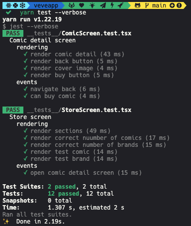
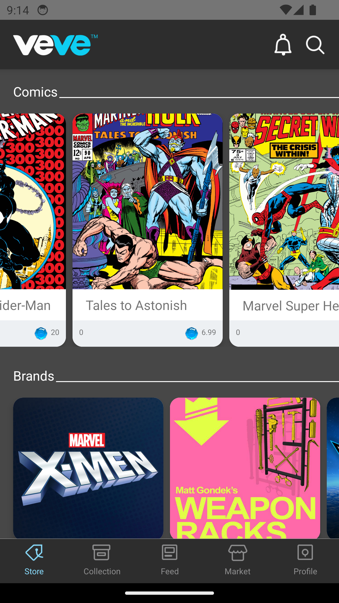
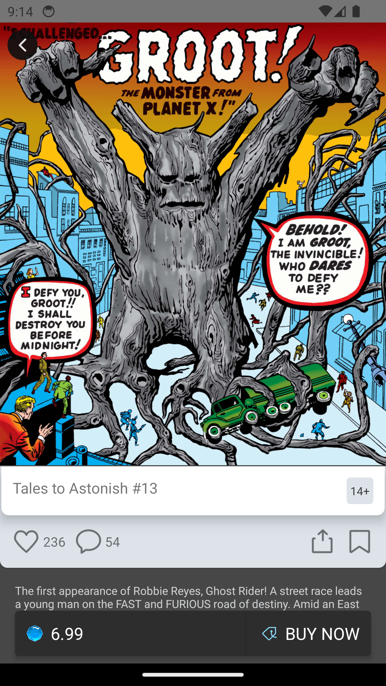

[](https://github.com/facebook/react-native/releases)
[](https://www.typescriptlang.org/docs/handbook/release-notes/typescript-3-7.html)

# Introdution

Comic App Demo
- Suports mobile and tablet devices
- Functions: Purchase and read comics
- Demonstrate quickly scafolt a RN app using ** npx react-native@latest init **
Set up Navigation, Theme, and using modern testing tool React Native Testing Library for quickly test the app functions

## Choice of technologies
- React Native version 0.72.3
- React Navigation: for all navigation stuffs
    - @react-navigation/native @react-navigation/native-stack react-native-safe-area-context react-native-screens @react-navigation/bottom-tabs 
- React Native Fast Image for faster image downloading and images caching out of the box as the app has to dowload and render a lot of images
- Use a custom theme and context to fully control the app appearance(Maybe consider using a UI lib?)
- Testing:
    - React native testing library
    - Jest

## Ideas for improvement
- Comic Detail Screen: Add zoom gesture and animation for the comic detail screen cover image(similar to instagram)
- Add shared-transition animation for thumbnail to the comic detail screen
- Use reanimaed Carousel component instead of the base ScrollView to have a better performance https://github.com/dohooo/react-native-reanimated-carousel
- Carousels should be able to auto scrolling(allow loop)

## To be production ready, needs:
- Connect to real APIs  & implement API module
- Add app Icon
- Add Splash screen
- Add App environment variables
- Choose and set Font family for the app
- Update to have high quality assets for icons(@3x)
- Comic Detail Screen: Add zoom gesture and animation for the comic cover image(similar to instagram)
- Add shared-transition animation for thumbnail to the comic detail screen
- Optimal design for tablet: add break points(base on screen sizes, like tthe css media query) and optimize layout, sizes, font sizes… for each device groups.
- Add redux, redux-toolkit, RTK query and setup cache for optimize API loading performance
- Add more test on dump components
- Add more defensive code in case data could be nullable
- Add E2E testing tool like Detox
- ...

## Testing
On this we will demo test 2 screens:
- The Store screen
- The Comic deail screen

To run all the tests
    yarn test




## Demo
- Iphone


Screenshots:
- Android:

 

- iPad:
 


# How to run the app

>**Note**: Make sure you have completed the [React Native - Environment Setup](https://reactnative.dev/docs/environment-setup) instructions till "Creating a new application" step, before proceeding.

## Step 1: Start the Metro Server

First, you will need to start **Metro**, the JavaScript _bundler_ that ships _with_ React Native.

To start Metro, run the following command from the _root_ of your React Native project:

```bash
# using npm
npm start

# OR using Yarn
yarn start
```

## Step 2: Start your Application

Let Metro Bundler run in its _own_ terminal. Open a _new_ terminal from the _root_ of your React Native project. Run the following command to start your _Android_ or _iOS_ app:

### For Android

```bash
# using npm
npm run android

# OR using Yarn
yarn android
```

### For iOS

```bash
# using npm
npm run ios

# OR using Yarn
yarn ios
```

If everything is set up _correctly_, you should see your new app running in your _Android Emulator_ or _iOS Simulator_ shortly provided you have set up your emulator/simulator correctly.

This is one way to run your app — you can also run it directly from within Android Studio and Xcode respectively.
